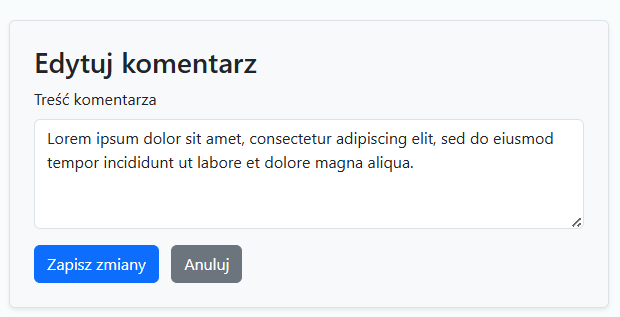
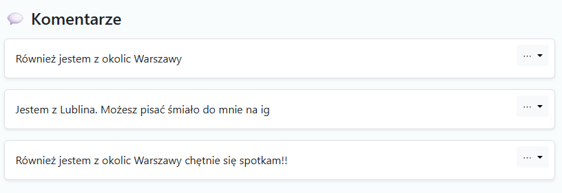

# 🌍 Razem Przez Świat – Travel Forum

## 🌐 Opis aplikacji

**Razem Przez Świat** to aplikacja webowa służąca do dzielenia się wspomnieniami z podróży.

Pozwala użytkownikom:
- tworzyć i przeglądać posty z relacjami z różnych krajów,
- dodawać komentarze i lajki,
- filtrować posty według kraju.

Dodatkowo udostępnia **pełne REST API** do zarządzania postami w formacie **JSON**.

---

## 🚀 Demo

Zobacz aplikację w akcji:  
👉 **[https://travel-forum-rest-api-2.onrender.com/](https://travel-forum-rest-api-2.onrender.com/)**

---

## 📋 Spis treści

1. [🔥 Funkcjonalności](#-funkcjonalności)  
2. [🛠 Technologie](#-technologie)  
3. [🖼️ Ekrany aplikacji](#-ekrany-aplikacji)

---

## 🔥 Funkcjonalności

### 📝 Posty (CRUD)
- Dodawanie posta z:
  - tytułem
  - treścią
  - lokalizacją
  - wyborem kraju
  - 1–2 zdjęciami
- Edycja i usuwanie postów
- Możliwość usunięcia pojedynczego zdjęcia przy edycji

### 💬 Komentarze
- Dodawanie komentarzy pod postami
- Edycja i usuwanie komentarzy

### ❤️ Lajki
- Przycisk „❤️ Lubię to”
- Licznik lajków

### 🌍 Filtrowanie po kraju
- Rozwijane menu „Relacje z podróży” z ikonami flag
- Po kliknięciu – wyświetlanie postów z danego kraju

### 🔄 REST API (format JSON)
- wszystkie posty GET `/api/posts`  
  - pojedynczy post GET `/api/posts/<id>`  
  - tworzenie POST `/api/posts`  
  - aktualizacja PUT `/api/posts/<id>`  
  - usuwanie DELETE `/api/posts/<id>` 

---

## 🛠 Technologie

> **Backend:**  
> Python 3.9+  
> Flask  
> Flask-SQLAlchemy  
> Flask-Migrate (Alembic)  
> Flask-WTF  

> **Frontend:**  
> HTML5  
> CSS3  
> Bootstrap 5  

> **Baza danych:**  
> SQLite

---

## 🖼️ Ekrany aplikacji

### 🏠 Strona główna – lista postów

> Widok główny aplikacji z listą postów oraz możliwością filtrowania według kraju.

**📷 Strona główna**

  

---

### ➕ Dodawanie posta

> Formularz umożliwiający dodanie nowego wpisu z danymi i zdjęciami.

**📷 Pusty formularz dodawania posta**

  

**📷 Wypełnianie formularza posta**

  

**📷 Podgląd dodanego posta**

  

---

### ✏️ Edycja posta

> Możliwość zmiany tytułu, treści, lokalizacji, zdjęć oraz kraju.

**📷 Formularz edycji posta**

  

**📷 Opcje edytowania i usuwania posta**

  

**📷 Wybieranie nowego zdjęcia**

  

**📷 Widok po edycji posta**

  

### 🗑️ Usuwanie zdjęcia z posta

> Możesz usunąć zdjęcie lub zdjęcia z posta podczas edycji.

**📷 Obecne zdjęcie i opcja usunięcia**

  

**📷 Podgląd posta po usunięciu zdjęcia**

  

---

### ❤️ Lajkowanie i 💬 komentowanie postów

> Użytkownicy mogą zostawiać komentarze i serduszka pod postami.

**📷 Post z komentarzem i 5 lajkami**

  

**📷 Formularz dodania komentarza oraz mini podgląd posta**

  

---

### 🗨️ Edycja komentarzy

> Sekcja komentarzy z możliwością dodania nowego wpisu.

**📷 Dodanie komentarzy które chcielibyśmy edytować**

  

**📷 Menu opcji komentarza: edytuj lub usuń**

  

---

### ✏️ Edycja komentarza

> Komentarze można również edytować lub usunąć.

**📷 Formularz edycji komentarza**

  

**📷 Poprawione komentarze po użyciu opcji edytuj**

  

---

### 🗑️ Usuwanie komentarza

> Komentarz można bezpiecznie usunąć jednym kliknięciem.

**📷 Przykład komentarza z danymi osobowymi i opcją usunięcia**

  

### 🌍 Filtrowanie postów po kraju

> Podczas dodawania posta użytkownik wybiera kraj z listy rozwijanej.  
> Wybrany kraj (np. **Włochy**) staje się tagiem przypisanym do posta i umożliwia późniejsze filtrowanie treści według państw.

**📷 Wybranie taga – np. Włochy – w formularzu dodania posta**

  

> Umożliwia wybór konkretnego kraju, który chcesz obejrzeć – np. klikając „Włochy” zobaczysz tylko posty z tego kraju.

**📷 Rozwijane menu „Relacje z podróży” z ikonami flag**

  

**📷 Przykład działania filtra – tylko posty z Włoch**

  

