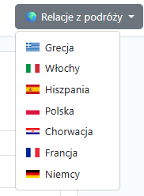

> **Travel Forum**  
> Aplikacja webowa „Razem Przez Świat” pozwala na tworzenie, przeglądanie i zarządzanie postami podróżniczymi z funkcjami komentarzy, lajków oraz filtrowania po kraju. Udostępnia też pełne REST API dla CRUD w formacie JSON.

---

## 🚀 Demo

Zobacz działającą wersję na Render:
**https://travel-forum-rest-api-2.onrender.com/**

## 🖼️ Ekrany aplikacji

### Strona główna: lista postów z menu krajów & przyciskiem „Dodaj nowy post”

