# 🌍 Razem Przez Świat – Travel Forum

## 🌐 Opis aplikacji

**Razem Przez Świat** to aplikacja webowa służąca do dzielenia się wspomnieniami z podróży.

Pozwala użytkownikom:
- tworzyć i przeglądać posty z relacjami z różnych krajów,
- dodawać komentarze i lajki,
- filtrować posty według kraju.

Dodatkowo udostępnia **pełne REST API** do zarządzania postami w formacie **JSON**.

---

## 🚀 Demo

Zobacz aplikację w akcji:  
👉 **[https://travel-forum-rest-api-2.onrender.com/](https://travel-forum-rest-api-2.onrender.com/)**

---

## 📋 Spis treści

1. [🔥 Funkcjonalności](#-funkcjonalności)  
2. [🛠 Technologie](#-technologie)  
3. [🖼️ Ekrany aplikacji](#-ekrany-aplikacji)

---

## 🔥 Funkcjonalności

### 📝 Posty (CRUD)
- Dodawanie posta z:
  - tytułem
  - treścią
  - lokalizacją
  - wyborem kraju
  - 1–2 zdjęciami
- Edycja i usuwanie postów
- Możliwość usunięcia pojedynczego zdjęcia przy edycji

### 💬 Komentarze
- Dodawanie komentarzy pod postami
- Edycja i usuwanie komentarzy

### ❤️ Lajki
- Przycisk „❤️ Lubię to”
- Licznik lajków

### 🌍 Filtrowanie po kraju
- Rozwijane menu „Relacje z podróży” z ikonami flag
- Po kliknięciu – wyświetlanie postów z danego kraju

### 🔄 REST API (format JSON)
- wszystkie posty GET `/api/posts`  
  - pojedynczy post GET `/api/posts/<id>`  
  - tworzenie POST `/api/posts`  
  - aktualizacja PUT `/api/posts/<id>`  
  - usuwanie DELETE `/api/posts/<id>` 

---

## 🛠 Technologie

> **Backend:**  
> Python 3.9+  
> Flask  
> Flask-SQLAlchemy  
> Flask-Migrate (Alembic)  
> Flask-WTF  

> **Frontend:**  
> HTML5  
> CSS3  
> Bootstrap 5  

> **Baza danych:**  
> SQLite

---

## 🖼️ Ekrany aplikacji

### 🏠 Strona główna – lista postów

> Widok główny aplikacji z listą postów oraz możliwością filtrowania według kraju.

**📷 Strona główna z menu krajów**

  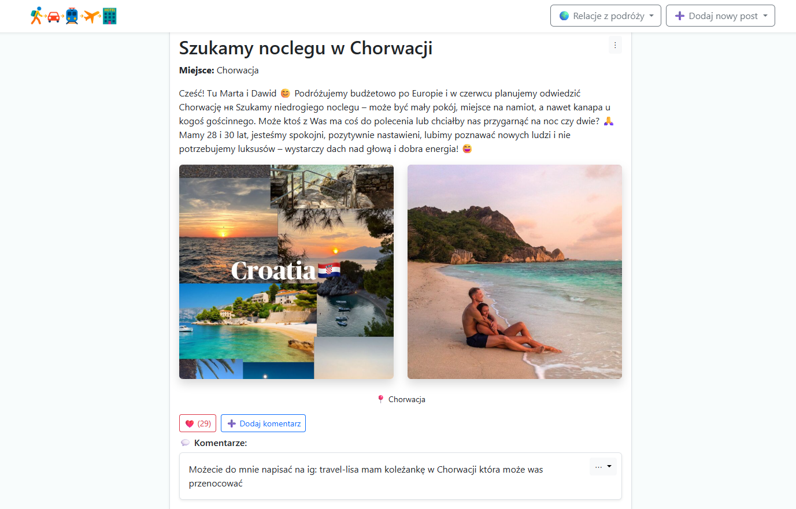

---

### ➕ Dodawanie posta

> Formularz umożliwiający dodanie nowego wpisu z danymi i zdjęciami.

**📷 Pusty formularz dodawania posta**

  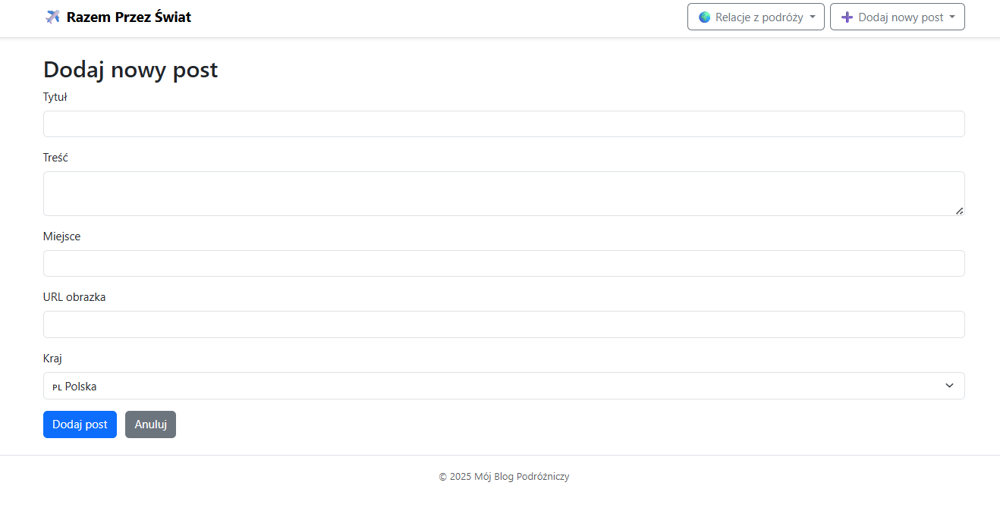

**📷 Wypełnianie formularza posta**

  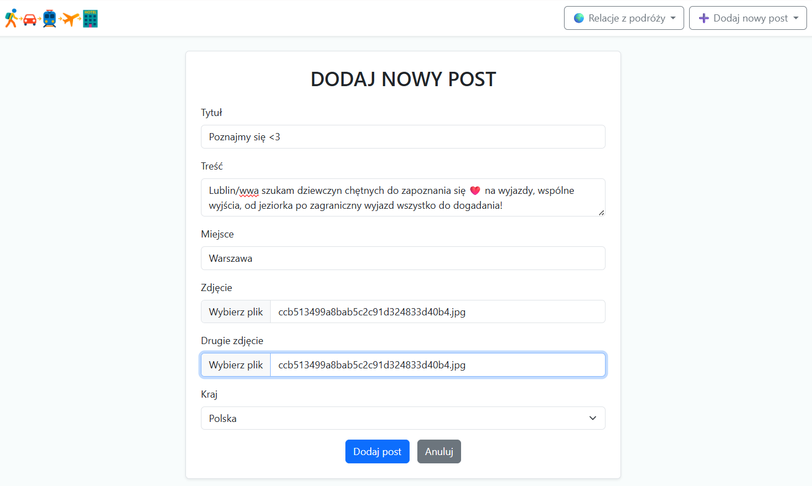

**📷 Podgląd dodanego posta**

  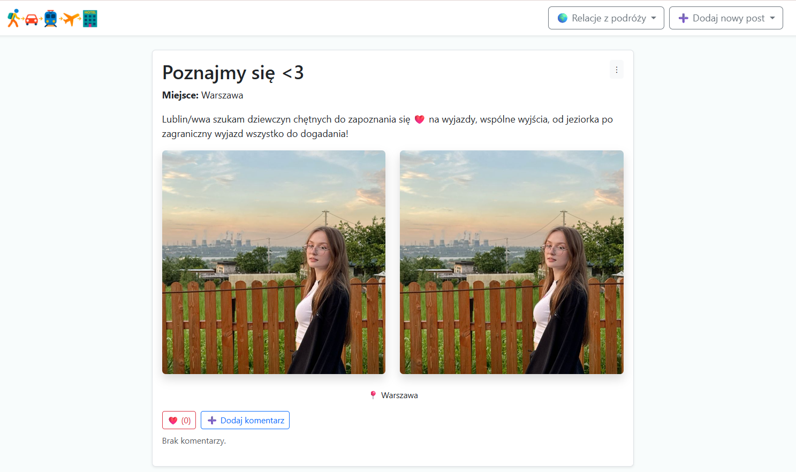

---

### ✏️ Edycja posta

> Możliwość zmiany tytułu, treści, lokalizacji, zdjęć oraz kraju.

**📷 Formularz edycji posta**

  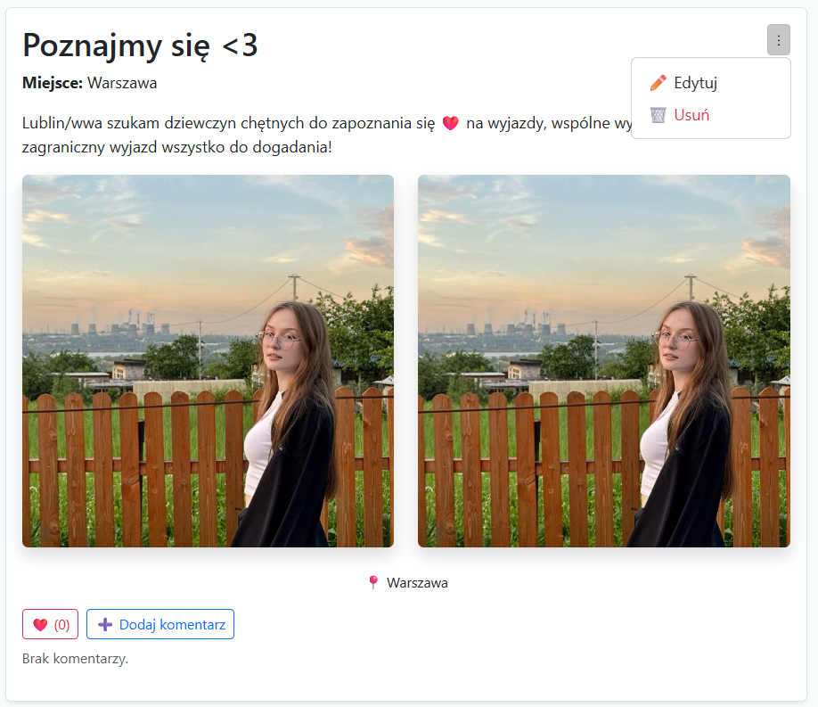

**📷 Wybieranie nowego zdjęcia**

  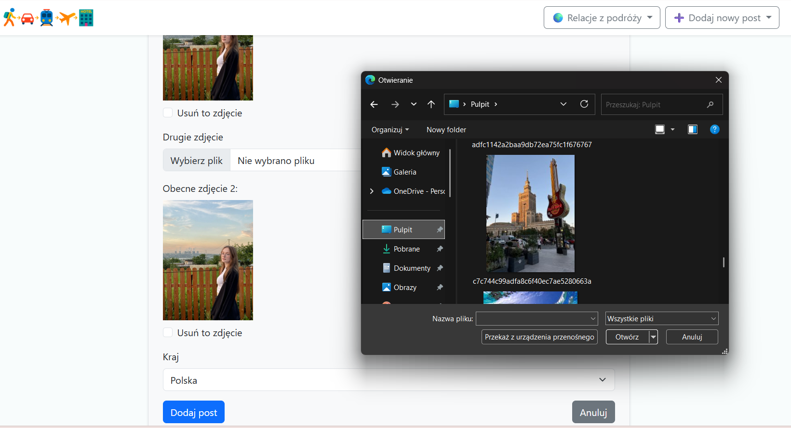

**📷 Widok po edycji posta**

  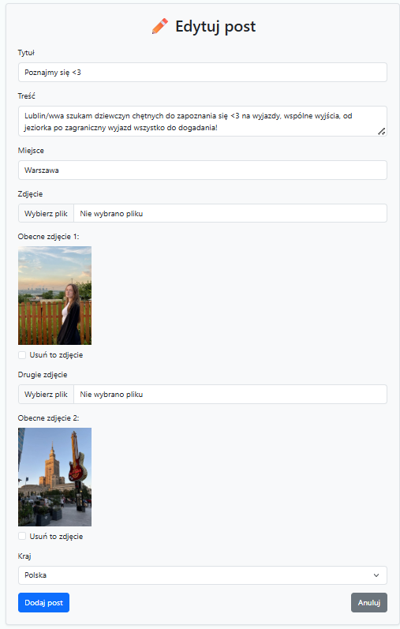

**📷 Opcje edytowania i usuwania posta**

  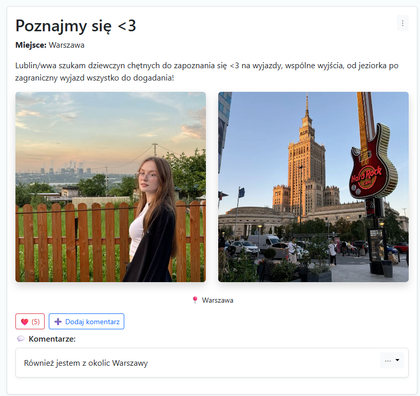

### 🗑️ Usuwanie zdjęcia

  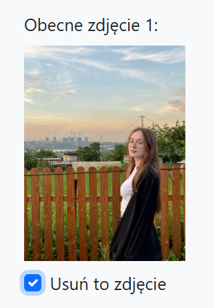
  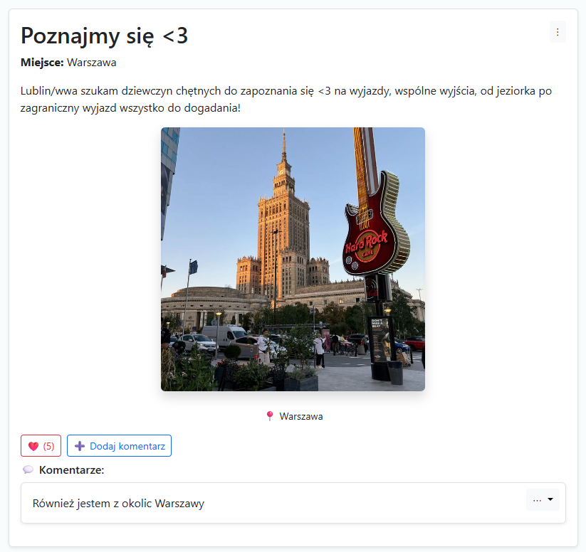

### 💬 Komentarze

  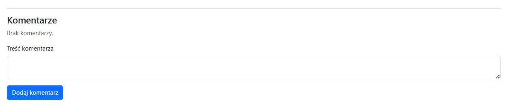
  
  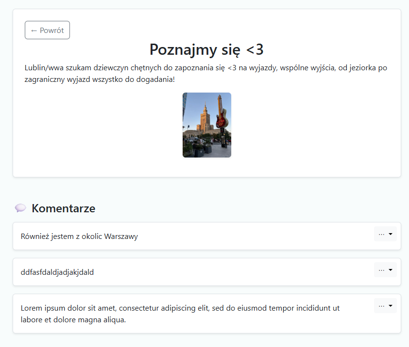
  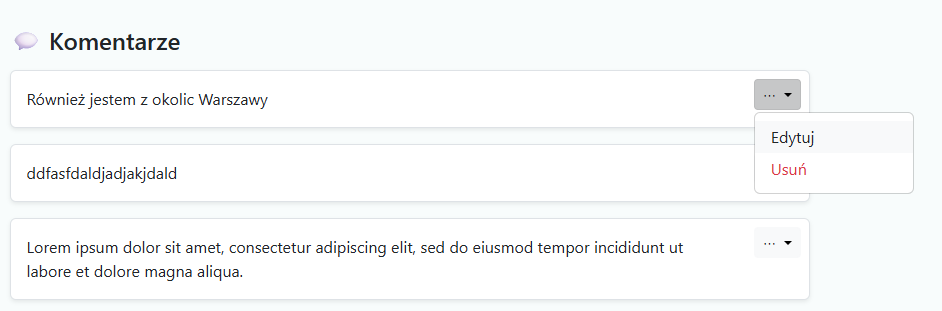
  

### 🌐 Filtrowanie według kraju

  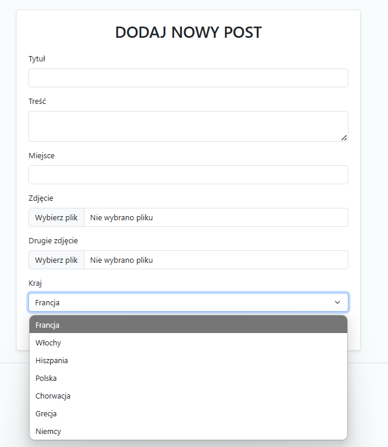
  
  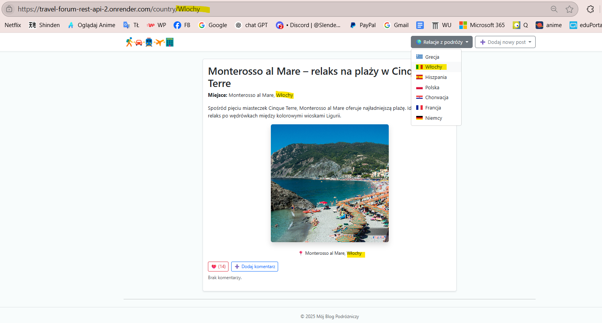

