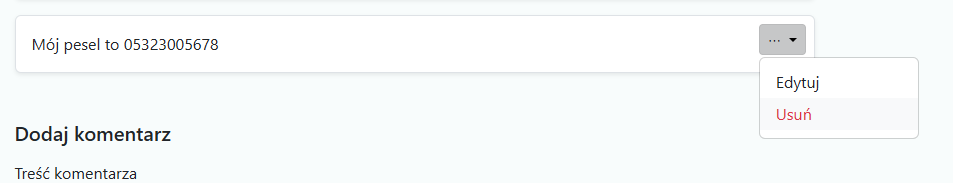
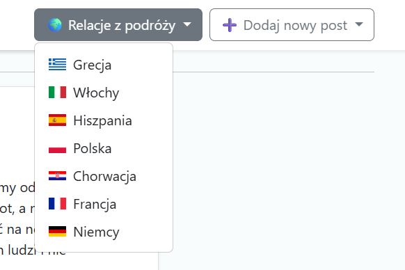

> **Travel Forum**  
> Aplikacja webowa „Razem Przez Świat” pozwala na tworzenie, przeglądanie i zarządzanie postami podróżniczymi z funkcjami komentarzy, lajków oraz filtrowania po kraju. Udostępnia też pełne REST API dla CRUD w formacie JSON.

---

## 🚀 Demo

Zobacz działającą wersję na Render:
**https://travel-forum-rest-api-2.onrender.com/**

## 📋 Spis treści

1. [Funkcjonalności](#funkcjonalności)  
3. [Technologie](#technologie) 
2. [Ekrany aplikacji](#ekrany-aplikacji)  

 

---

## 🔥 Funkcjonalności

- **CRUD postów**  
  - dodawanie tytułu, treści, lokalizacji, jednego lub dwóch zdjęć oraz wyboru kraju  
  - edycja i usuwanie posta  
  - usuwanie pojedynczego zdjęcia przy edycji  
- **Komentarze**  
  - dodawanie, edycja i usuwanie komentarzy pod każdym postem  
- **Lajki**  
  - prosty system „❤️ Lubię to” 
  - licznik lajków  
- **Filtrowanie**  
  - rozwijane menu „Relacje z podróży” z listą krajów (z ikonami flag)  
  - po kliknięciu – wyświetlenie tylko postów z danego kraju  
- **REST API**  
  - wszystkie posty GET `/api/posts`  
  - pojedynczy post GET `/api/posts/<id>`  
  - tworzenie POST `/api/posts`  
  - aktualizacja PUT `/api/posts/<id>`  
  - usuwanie DELETE `/api/posts/<id>`  

---

## Technologie 
## 🖼️ Ekrany aplikacji

### Strona główna: lista postów z menu krajów & przyciskiem „Dodaj nowy post”

